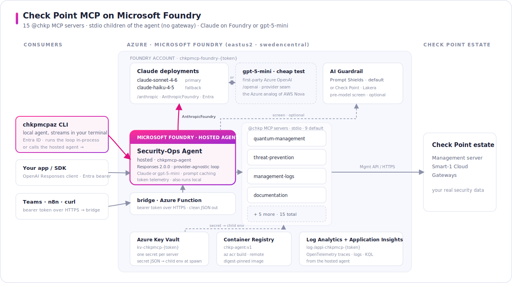
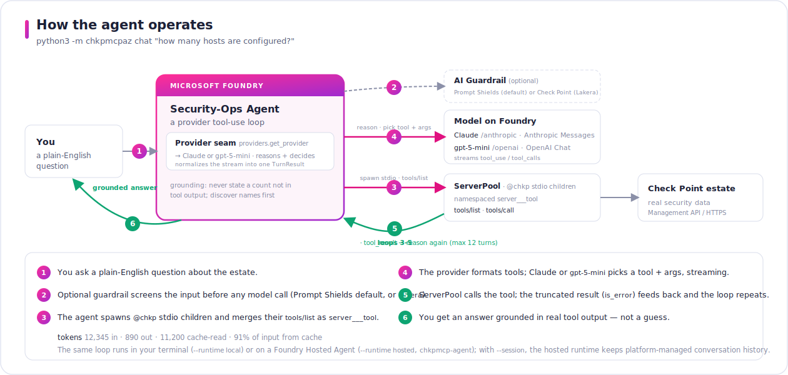
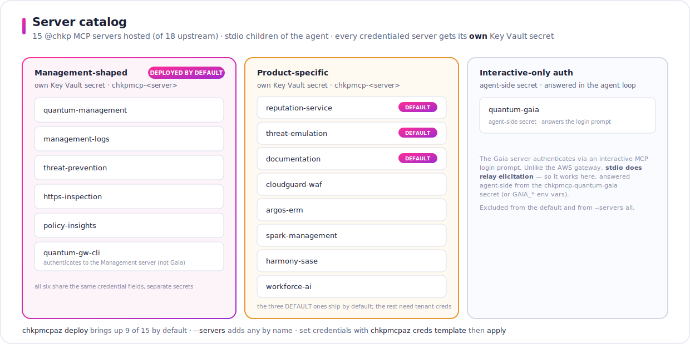

# Check Point MCP on Microsoft Foundry


<br>


A **demo and reference tool** for running Check Point's Model Context Protocol servers with **Claude on Microsoft Foundry**. It is the Azure mirror of [checkpoint-mcp-on-aws-agentcore] — the same **security-operations agent**, the same **15 `@chkp` MCP servers**, the same grounded-answer discipline — rebuilt on **Foundry Hosted Agents**, **Bicep + azd**, **Azure Key Vault**, and **Azure AI Content Safety**. The `@chkp` servers run as **stdio child processes** the agent spawns itself — **no gateway tier** (that topology is AWS-only) — and the agent is **multi-provider**: the production path is **Claude on Foundry**, or the *identical* tool loop on a cheap first-party **Azure OpenAI `gpt-5-mini`** deployment — the Azure analog of **Amazon Nova** as the cheap Bedrock test model on AWS.

<p align="center">
  <a href="docs/img/architecture.pdf" title="Open the full-size, zoomable diagram (vector PDF — GitHub's viewer has zoom controls)"></a>
</p>

Everything runs through one cross-platform CLI (`python3 -m chkpmcpaz …`, or the installed `chkpmcpaz`) on Windows, macOS, and Linux — no bash, jq, or curl required, and no local Docker (the agent image builds remotely in ACR). Tools are namespaced `«server»___«tool»` (e.g. `quantummanagement___show_hosts`), identical to the AWS namespacing. Jump to the **[Quick Start](#quick-start)**.

---

## What you get

### 1 · Check Point MCP servers — 15 of 18

Every published `@chkp` MCP server this project hosts (15 of the 18 upstream), each spawned as its own pinned **stdio child process** (`npx -y @chkp/<server>-mcp@<pin>`) of the agent. There is **no gateway by default** — the AWS port aggregates these same servers behind one AgentCore Gateway; Azure runs them as **stdio children of the agent** in both runtimes instead, and adds an opt-in **`deploy --remote-mcp`** tier (a shared, Entra-authenticated Container App per server — the AgentCore-Gateway analogue) when a second consumer needs them (the topology difference and this tier are in **[docs/aws-vs-azure.md](docs/aws-vs-azure.md)**). `deploy` seeds Key Vault secrets for **9 servers by default** — the six management-shaped servers, the two ThreatCloud servers, and `documentation`. `--servers all` expands to 11; every server stays selectable **by name**. See the **[server catalog](#server-catalog)**.

### 2 · Claude on Foundry — and a cheap gpt-5-mini test path

The agent talks to **Claude deployments on your own Foundry account** (`claude-sonnet-4-6` primary, `claude-haiku-4-5` fallback) through the account's `/anthropic` route with the official `AnthropicFoundry` client — **Entra ID** bearer tokens, no API keys anywhere. The Bicep deploy creates the model deployments; they die with the resource group on `destroy`, so there is nothing to revoke.

The same loop also runs on a first-party **Azure OpenAI `gpt-5-mini`** deployment for cheap testing. A small **provider seam** (`chkpmcpaz.providers.get_provider` → `AnthropicProvider` | `AzureOpenAIProvider`) speaks each vendor's native wire format — Anthropic Messages for Claude, OpenAI Chat Completions for `gpt-5-mini` — behind one identical tool loop. The provider is **auto-detected** from the model name (`gpt-*`/`o1`/anything with `openai` → `azure-openai`, else `anthropic`), or forced with `--provider {auto,anthropic,azure-openai}` / `CHKP_PROVIDER`. Default is `anthropic` (production). See **[Test cheaply without Claude](#test-cheaply-without-claude-like-aws-nova)**.

### 3 · An agent that uses them

`python3 -m chkpmcpaz chat "…"` runs a Claude tool-use loop: it spawns the selected `@chkp` servers as stdio children, merges their tool catalogs under namespaced names, reasons about your question, calls the Check Point tools, and returns an answer **grounded in real tool output** — the system prompt forbids invented counts and unverified claims. The loop uses **prompt caching** (`cache_control` on the static system prompt and the tool block), **streaming** output, and per-run **token telemetry**:

```
tokens  12,345 in · 890 out · 11,200 cache-read · 91% of input from cache
```

The **identical loop** runs in your terminal (`--runtime local`) or on a **Foundry Hosted Agent** (`--runtime hosted`) — a managed, Entra-authenticated HTTPS endpoint speaking the **Responses protocol** that your own apps can call, with **platform-managed conversation history** via `--session`. When a deploy stood up a hosted agent, a plain `chat` targets *your* deployed agent by default (AWS-parity); pass `--runtime local` to run the loop in your process instead.

<p align="center">
  <a href="docs/img/agent-flow.pdf" title="Open the full-size, zoomable diagram (vector PDF — GitHub's viewer has zoom controls)"></a>
</p>

---

## Quick Start

<details>
<summary><b>Full setup walkthrough</b> — fresh clone → venv + install → az login → doctor → deploy → chat &nbsp;·&nbsp; <i>click to expand</i></summary>

<br>

Everything runs through one cross-platform CLI in the [chkpmcpaz](chkpmcpaz) package — Windows, macOS, and Linux. Every command block is safe to paste as-is (no inline comments), and each works as either `python3 -m chkpmcpaz …` or the installed `chkpmcpaz …` entry point.

### Prerequisites

| Need | Notes |
|---|---|
| Azure subscription with **pay-as-you-go billing** | *Claude path only.* Claude on Foundry rejects CSP, free-trial, student, and credit-only sponsored subscriptions. `doctor` warns about this. The **`gpt-5-mini` test path is exempt** — it is first-party and deploys on MSDN / Dev-Test / credit subscriptions ([Test cheaply](#test-cheaply-without-claude-like-aws-nova)). |
| Azure Marketplace terms for Claude | *Claude path only.* Deploying via Bicep **auto-accepts Anthropic's commercial terms** through the `modelProviderData` block — your organization name, country code, and industry are sent to Anthropic (see [Claude terms](#claude-terms-and-regions)). Your identity needs permission to subscribe to Marketplace model offerings. `gpt-5-mini` is first-party (no Marketplace offer, no `--org`, no terms attestation). |
| `az` (Azure CLI) + `azd` (Azure Developer CLI ≥ 1.25.3) | `azd provision` / `azd down` own the Bicep infra; the CLI orchestrates them. |
| Docker | Listed for completeness — the default deploy builds the agent image **remotely** with `az acr build`, so local Docker is only needed if you want to build or run the container yourself. |
| Node.js 20+ (`node` / `npx`) | The `@chkp` MCP servers are npm packages run via `npx`. |
| Python 3.11+ | The CLI and agent. |
| Check Point credentials | Smart-1 Cloud or Management server API key for the management-shaped servers; ThreatCloud / Infinity Portal keys for the others. Deploy works with placeholders; real data needs real credentials ([creds workflow](docs/scenarios/creds-and-golive.md)). |
| Azure RBAC | Contributor/Owner on the resource group to provision; the Bicep grants the deployer `Cognitive Services User`, `Key Vault Secrets Officer`, and `AcrPush` automatically. Note Owner/Contributor alone cannot *invoke* agents — data-plane access is separate. |

### 1. Get the code

```
git clone https://github.com/alshawwaf/checkpoint-mcp-on-azure-foundry.git
cd checkpoint-mcp-on-azure-foundry
```

Already cloned it before? Then instead:

```
cd checkpoint-mcp-on-azure-foundry
git pull
```

### 2. Install

From the repo folder (a virtual environment is recommended):

```
python3 -m venv .venv
source .venv/bin/activate
python3 -m pip install -e ".[mcp,hosting,dev]"
```

> Inside the venv, plain `python3` is Python 3 on every platform, which is why every command below is identical across shells. On **Windows PowerShell** activate with `.\.venv\Scripts\Activate.ps1` (if a policy error blocks it, run `Set-ExecutionPolicy -Scope CurrentUser -ExecutionPolicy RemoteSigned` once, then retry). If you open a new terminal later, `cd` back into the repo and re-activate first.

### 3. Log in to Azure

```
az login
azd auth login
```

The CLI uses your `az login` identity for the control plane and Entra ID bearer tokens for the data plane — no API keys anywhere. Target a specific subscription/tenant with the global `--subscription <id>` flag (or `az account set`).

### 4. Preflight

```
python3 -m chkpmcpaz doctor
```

Checks Python, `az` login, `azd` version, Node/npx, region support, the pay-as-you-go requirement, and the optional extras — warnings and hard failures clearly separated. It changes nothing. `doctor` is provider-aware: the pay-as-you-go/credit gate fires only for the `anthropic` (Claude) path; `gpt-5-mini` is first-party and skips it.

### 5. Deploy

The Claude deployment needs your organization name (sent to Anthropic with the terms acceptance — see [Claude terms](#claude-terms-and-regions)):

```
python3 -m chkpmcpaz deploy --org "Your Company Name"
```

That provisions the Bicep infra (Foundry account + project, Claude deployments, Key Vault, ACR, monitoring), seeds per-server **placeholder** secrets, builds the agent image remotely in ACR, creates the **Foundry Hosted Agent**, grants its identity the required roles, and smoke-tests the result. Typically 10–20 minutes; the Claude model-deployment LRO is the variable step. When it finishes, `deploy` prints a **clickable resource-links block** (resource group, Foundry portal, Key Vault, ACR, App Insights). A full transcript is always written to `~/.chkpmcpaz/logs/`. Re-runs are idempotent — if anything (including an expired session) interrupts it, re-run the same command.

Skip the hosted agent with `--no-agent`; pick servers with `--servers "<names or all>"`; pass real credentials at deploy time with `--creds chkp-credentials.env` (see step 7). For the cheap first-party model instead of Claude, deploy `--model gpt-5-mini` (no `--org` needed) — see [Test cheaply without Claude](#test-cheaply-without-claude-like-aws-nova).

### 6. Verify

```
python3 -m chkpmcpaz status
```

Read-only health of the whole stack: azd outputs, Foundry account/project, callable Claude (or `gpt-5-mini`) deployments, Key Vault secrets (placeholder-or-real, names only), the ACR image, hosted agent state, Content Safety reachability, and local Node/npx. It also prints the same clickable resource-links block. Safe to run repeatedly; `--json` for machines, `--tools` to also spawn the servers and report per-server tool counts.

### 7. Ask the agent

```
python3 -m chkpmcpaz chat "how many hosts are configured, and what access layers exist?"
```

The answer streams as it is generated; every run ends with the one-line token report. With placeholder credentials the tool calls reach nothing real and will error — that still proves the chain (Claude → tools → loop); swap in real Check Point credentials for real data.

**Already have the AWS project (`checkpoint-mcp-on-aws-agentcore`)?** Its `chkp-credentials.env` is byte-compatible — reuse it and you are done in one command:

```
cp ../checkpoint-mcp-on-aws-agentcore/chkp-credentials.env .
python3 -m chkpmcpaz creds apply
```

Starting fresh instead:

```
python3 -m chkpmcpaz creds template
python3 -m chkpmcpaz creds apply
```

Edit the gitignored `chkp-credentials.env` between the two — one `[server]` section of `KEY=VALUE` lines per server. Values go straight to Key Vault and are never printed or logged. `deploy --creds` applies the same file at deploy time (defaults to `chkp-credentials.env`), and fails loudly if the file is missing or still all placeholders.

Run the same loop on the managed runtime, with platform-managed conversation history:

```
python3 -m chkpmcpaz chat --runtime hosted --session soc-review "how many hosts are configured?"
```

`--model <model>` forces a specific deployment — a Claude name (`claude-sonnet-4-6`) or `gpt-5-mini`; the provider is auto-detected from the name (or set `--provider {auto,anthropic,azure-openai}` / `CHKP_MODEL` / `CHKP_PROVIDER`). Otherwise the agent auto-selects the first deployment it can call (Sonnet preferred on the Claude path). Run `python3 -m chkpmcpaz chat` with no task for a catalog of example questions (exit code 2).

### 8. Call it from Teams, n8n, or your own app

The Foundry Hosted Agent's Responses endpoint is a first-class HTTPS API, so real client software can use it — not just this CLI. Azure-aware clients mint an **Entra ID** bearer token and call the Responses endpoint directly; for everything else (Microsoft Teams via Power Automate, n8n, curl, webhooks) one command stands up a **bearer-token** front door — an Azure Function that forwards to the agent with its own managed identity:

```
python3 -m chkpmcpaz bridge provision
python3 -m chkpmcpaz bridge show --reveal-token
```

**Use case — ask the agent from any external tool (curl, a webhook, a Teams flow):** provision the bridge once, then POST a plain-English question with the bearer token. `bridge show` prints the concrete URL and the exact token-fetch command; the whole thing is copy-paste:

```bash
TOKEN=$(az keyvault secret show --vault-name <kv> --name chkpmcp-bridge-token \
  --query value -o tsv | python3 -c 'import sys,json;print(json.load(sys.stdin)["token"])')

curl -s -X POST 'https://func-chkpmcp-bridge-<hash>.azurewebsites.net/api/invoke' \
  -H "Authorization: Bearer $TOKEN" -H 'Content-Type: application/json' \
  -d '{"prompt": "How many access layers are configured and what are their names?", "session": "demo"}'
```

```json
{ "result": "There are 3 access layers configured: DNS_Layer, dynamic_layer, Network", "model": "chkpmcp-agent", "error": false }
```

The Function checks the bearer token (constant-time), then forwards the prompt to the hosted agent, which runs the full reason → `@chkp` tools → loop server-side and returns grounded JSON. Add `"session": "<id>"` to keep platform-managed conversation history across calls. Every call is authenticated; the token lives only in Key Vault, and `destroy` removes the bridge with the rest of the stack. The Teams and n8n recipes (and the Entra-native path with no bridge) are in **[invoke-from-anywhere](docs/scenarios/invoke-from-anywhere.md)**.

### 9. Terminate

```
python3 -m chkpmcpaz destroy
```

It inventories what actually exists (resource group, hosted agent, secrets including soft-deleted, ACR images, model deployments), prints the plan, and asks for `y/N` confirmation (`--yes` required in non-interactive shells). Teardown removes the hosted agent first, then `azd down --force --purge` — the purge clears the Key Vault and Cognitive Services soft-deletes so an immediate redeploy works. On a clean subscription it prints `Nothing to destroy.` Re-runs are safe.

### Options

**Server set.** `deploy` defaults to **9 of the 15 servers** — the six management-shaped, the two ThreatCloud servers, and `documentation`. `--servers all` expands to 11 (it omits `argos-erm`, `harmony-sase`, `workforce-ai`, and `quantum-gaia`); every server is selectable **by name**. `CHKP_SERVERS` works too:

```
python3 -m chkpmcpaz deploy --servers "quantum-management reputation-service cloudguard-waf"
```

**Cheap `gpt-5-mini` test path.** Skip Claude entirely and run the identical loop on a first-party Azure OpenAI deployment — deploys on MSDN / Dev-Test subscriptions where Claude is blocked. See [Test cheaply without Claude](#test-cheaply-without-claude-like-aws-nova).

**Optional guardrail — your choice of engine.** The guardrail is optional and screens the prompt *before* any model call (`chat --guardrail` for a local run, or `deploy --guardrail` to bake it into the hosted agent — persists `CHKP_GUARDRAIL=enforce`). Two interchangeable engines, selected with `--guardrail-provider` at deploy or the `CHKP_GUARDRAIL_PROVIDER` env var: **Azure AI Content Safety Prompt Shields** (`content-safety`, the **default** — Azure's own screening) or the **Check Point AI Guardrail (Lakera Guard)** (`lakera`) — one inline API call, GA, and **identical on AWS and Azure**. Customers already using the cloud's guardrail keep Prompt Shields; those wanting Check Point's own unified-across-clouds engine opt into `lakera` (set `LAKERA_API_KEY` / `LAKERA_PROJECT_ID`). Note the *deeper* Check Point agent/MCP runtime protection (beyond prompt screening) is still Early Access — contact Check Point. See [the guardrail scenario](docs/scenarios/guardrail.md).

**Second stack in the same subscription.** `--prefix <name>` (pattern `^[a-z][a-z0-9-]{0,11}$`) namespaces every resource.

**Subscription / region per command.** `--subscription <id>` and `--location <loc>` work on every subcommand (before or after it); `AZURE_SUBSCRIPTION_ID` / `AZURE_LOCATION` are honored too.

</details>

---

## Server catalog

<p align="center">
  <a href="docs/img/server-catalog.pdf" title="Open the full-size, zoomable diagram (vector PDF — GitHub's viewer has zoom controls)"></a>
</p>

`deploy` brings up **9 servers by default**: the six management-shaped ones, `reputation-service` and `threat-emulation` (ThreatCloud API keys), and `documentation` (Infinity Portal key). `--servers all` expands to **11** (adding `cloudguard-waf` and `spark-management`); `argos-erm`, `harmony-sase`, `workforce-ai`, and `quantum-gaia` stay out of `all` and are deployed explicitly by name. **Every credentialed server gets its own Key Vault secret** named `<prefix>-<server>` (e.g. `chkpmcp-quantum-management`) — so `quantum-management` and `management-logs` can point at *different* management servers; nothing is shared. Unlike the AWS gateway topology, stdio **does** relay MCP elicitation, so `quantum-gaia`'s interactive login works here — answered agent-side from the `chkpmcp-quantum-gaia` secret or `GAIA_*` env vars.

<details>
<summary>Full catalog — 15 servers, pins, and credential shapes</summary>

The 15 `@chkp` servers, their pinned versions, and their credential shapes are also cataloged in **[docs/servers.md](docs/servers.md)**.

| Server (`@chkp/…-mcp` @ pin) | Credential shape (Key Vault secret keys) | Default 9 | `all` (11) |
|---|---|---|---|
| `quantum-management` @ 1.4.7 | `MANAGEMENT_HOST`, `MANAGEMENT_PORT`, `API_KEY` | ✅ | ✅ |
| `management-logs` @ 1.4.6 | management fields, own secret | ✅ | ✅ |
| `threat-prevention` @ 1.5.4 | management fields, own secret | ✅ | ✅ |
| `https-inspection` @ 1.4.6 | management fields, own secret | ✅ | ✅ |
| `policy-insights` @ 0.3.5 | management fields, own secret | ✅ | ✅ |
| `quantum-gw-cli` @ 1.4.8 | management fields — authenticates to **Management**, not Gaia | ✅ | ✅ |
| `reputation-service` @ 1.3.1 | `API_KEY` (ThreatCloud) | ✅ | ✅ |
| `threat-emulation` @ 1.3.1 | `API_KEY` (ThreatCloud) | ✅ | ✅ |
| `documentation` @ 1.4.6 | `CLIENT_ID`, `SECRET_KEY` (Infinity Portal); starts with `--region US` automatically | ✅ | ✅ |
| `cloudguard-waf` @ 0.1.0 | `WAF_CLIENT_ID`, `WAF_ACCESS_KEY`, `WAF_REGION` | — | ✅ |
| `spark-management` @ 1.4.8 | `CLIENT_ID`, `SECRET_KEY`, `INFINITY_PORTAL_URL` | — | ✅ |
| `argos-erm` @ 0.5.4 | `ARGOS_API_KEY`, `ARGOS_CUSTOMER_ID` — needs real creds to list tools | — | excluded |
| `harmony-sase` @ 1.3.1 | `API_KEY`, `MANAGEMENT_HOST`, `ORIGIN` | — | excluded |
| `workforce-ai` @ 1.1.0 | `CP_CI_CLIENT_ID`, `CP_CI_ACCESS_KEY`, `CP_CI_GATEWAY` | — | excluded |
| `quantum-gaia` @ 1.3.5 | none in-process; agent-side `gaia` secret answers its interactive login | — | excluded |

</details>

## Command reference

| Command | What it does |
|---|---|
| `chkpmcpaz deploy` | Full stack up: Bicep infra, model deployments, placeholder secrets, agent image, hosted agent, RBAC, smoke test — prints a clickable resource-links block (`--org` for the Claude path, `--model gpt-5-mini` for the cheap first-party test path with no `--org`, `--servers`, `--creds [file]`, `--no-agent`, `--guardrail`, `--guardrail-provider {content-safety,lakera}`, `--provider`). |
| `chkpmcpaz chat "…"` | Run the security-ops agent — Claude on Foundry or `gpt-5-mini` through the provider seam (`--runtime {local,hosted}`, `--model`, `--provider`, `--session <id>` for platform-managed history, `--actor`, `--guardrail`, `--servers`). Defaults to *your* hosted agent when one is deployed (AWS-parity); no task → exit 2 with example questions. |
| `chkpmcpaz status` | Read-only health of every stack component, with specific remediation per failure (`--json`, `--tools` also spawns the servers and reports per-server tool counts). |
| `chkpmcpaz doctor` | Local preflight: tooling, login, region, subscription type, extras — provider-aware, so the credit/MSDN eligibility FAIL fires only for the Claude path, not `gpt-5-mini` (`--provider`, `--model`). |
| `chkpmcpaz refresh` | Bump the hosted agent version so its sandboxes restart and re-read Key Vault secrets. |
| `chkpmcpaz creds {template,apply}` | Local gitignored INI → per-server Key Vault secrets → refresh (`--file`, default `chkp-credentials.env`). |
| `chkpmcpaz models {status,enable,disable}` | The active provider's preferred deployments (Claude, or `gpt-5-mini` on an `azure-openai` stack): presence + live probe, ensure-they-exist, or delete the ones this stack created. |
| `chkpmcpaz bridge {provision,show,destroy}` | Bearer-token HTTPS front door (Azure Function) so Teams/n8n/curl can call the agent without an Entra token (`--reveal-token`); the token lives only in Key Vault. |
| `chkpmcpaz guardrail {test,verify,provision,enforce,destroy}` | Guardrail self-test / reachability / mode guidance for the selected engine — Prompt Shields (default) or the Check Point AI Guardrail (Lakera Guard) via `--guardrail-provider lakera`; off/observe/enforce (`--enforce`). |
| `chkpmcpaz destroy` | Read-only inventory → plan → confirm → teardown (hosted agent, then `azd down --force --purge`) (`--yes`, `--force-delete-secret`). |

Global flags — accepted **before or after** any subcommand: `--subscription <id>`, `--location <loc>`, `--prefix <p>`, `--plain`, `--version`. Bare `chkpmcpaz` prints full help (exit 0).

Exit codes: `0` success · `1` failure (including partial deploy and hosted in-agent errors) · `2` usage (missing task, unknown server) · `130` Ctrl-C.

The command surface matches the AWS port (`chkpmcpaws`): `deploy, chat, status, doctor, refresh, creds, models, bridge, guardrail, destroy`. Full flag-by-flag reference with the exact UX strings: **[docs/commands.md](docs/commands.md)**.

## What this repo builds

Fixed, derived resource names — so `destroy` always finds what `deploy` made. `<token>` is Bicep's `uniqueString(subscription().id, environmentName)`.

| Resource | Name |
|---|---|
| Resource group | `rg-<prefix>` → `rg-chkpmcp` |
| Foundry account (kind `AIServices`) | `<prefix>-foundry-<token>` (custom subdomain = same) |
| Foundry project | `<prefix>-project` |
| Claude deployments | `claude-sonnet-4-6` (primary), `claude-haiku-4-5` (fallback) |
| Key Vault | `kv-<prefix>-<token>` (trimmed to 24 chars) |
| Key Vault secret per server | `<prefix>-<server>` → `chkpmcp-quantum-management` |
| Container registry | `acr<prefix-no-hyphens><token>` (alphanumeric, trimmed to 50) |
| Agent image | `<acr login server>/chkp-agent:v1` |
| Hosted agent | `<prefix>-agent` → `chkpmcp-agent` (Responses protocol `2.0.0`, port 8088) |
| Log Analytics / App Insights | `log-<prefix>-<token>` / `appi-<prefix>-<token>` |
| Tags | `project=chkp-mcp-foundry`, `stack=<prefix>` |

`--prefix <name>` (pattern `^[a-z][a-z0-9-]{0,11}$`) namespaces everything for a parallel stack in the same subscription. Every resource, role assignment, and Bicep output is documented in **[docs/resources.md](docs/resources.md)**.

## Status & positioning

| Area | Status | Plain-language positioning |
|---|---|---|
| MCP servers as stdio children of the agent | Field-tested | Each `@chkp` server runs as a pinned `npx` stdio child of the agent — **no gateway tier** by default. The same servers sit behind one AgentCore Gateway on AWS; here they run in-process in both the local and hosted runtimes. |
| Remote MCP tier (shared, authenticated) — opt-in | Built (`deploy --remote-mcp`) | The AgentCore-Gateway analogue: each `@chkp` server *also* runs as its own scale-to-zero **Azure Container App** (streamable-HTTP) behind **Entra Easy Auth**, so a **second consumer** — Foundry portal agents, Copilot Studio, Claude Desktop, other MCP clients, or our own agent via `CHKP_MCP_TRANSPORT=remote` — can share the tools. See [remote-mcp](docs/scenarios/remote-mcp.md). |
| The agent through the provider seam | Field-tested | Proves the full chain on real estate data. Claude on Foundry (production) or first-party `gpt-5-mini` (cheap test) behind one identical tool loop; prompt caching, streaming, and token telemetry; grounded-answer discipline. |
| Hosted runtime + platform-managed history | Live-validated | The same loop runs on a Foundry Hosted Agent (Responses protocol, Entra-authenticated). `--session` keeps **platform-managed conversation history** — there is no separate memory store. |
| HTTPS bridge (Teams / n8n / curl) | Runnable | `bridge provision` fronts the hosted agent with a bearer-token Azure Function; the token lives only in Key Vault. See [invoke-from-anywhere](docs/scenarios/invoke-from-anywhere.md). |
| Direct local `@chkp` MCP use | GA Check Point MCP behavior | Inspect a `@chkp` package with the [local probe](docs/scenarios/local-probe.md) — no Azure required. |
| Optional guardrail (two engines) | Runnable | Prompt screening before the model, off by default. Default engine is **Azure AI Content Safety Prompt Shields** (Azure's own); opt in to the **Check Point AI Guardrail (Lakera Guard)** with `--guardrail-provider lakera` (GA, identical on AWS and Azure). The deeper Check Point agent/MCP *runtime* protection is Early Access — contact Check Point. |

## Test cheaply without Claude (like AWS Nova)

Claude on Foundry needs a pay-as-you-go subscription and Marketplace terms. For everyday testing you don't need it — run the **identical** `@chkp` tool loop on a first-party **Azure OpenAI `gpt-5-mini`** deployment instead. It is the Azure analog of falling back to **Amazon Nova** on Bedrock: a cheap, weaker-but-capable model that still exercises the whole chain (hosted agent → provider → `@chkp` MCP tools → grounded answer), end to end.

**Why it works where Claude doesn't.** `gpt-5-mini` is a **first-party** Azure OpenAI model (`format: 'OpenAI'`, version `2025-08-07`, `GlobalStandard`) — **not** a third-party Marketplace offer. There is no `modelProviderData` block, no Anthropic terms attestation, and **no `--org`**. That means it deploys on an **MSDN / Visual Studio Dev-Test subscription** (region `eastus2`, `gpt-5-mini` `GlobalStandard` quota 2000) where Claude is blocked, and the usage is **covered by your Visual Studio subscription credits — effectively free for testing**. `doctor` knows this: on the `azure-openai` provider it skips the pay-as-you-go / credit-offer check and reports the `gpt-5-mini` quota as OK.

**Deploy it.** The provider is auto-detected from `--model gpt-5-mini` (a `gpt-*` name → `azure-openai`); no `--org` is required. Point at your Dev-Test subscription with the global `--subscription` flag:

```
python3 -m chkpmcpaz deploy --model gpt-5-mini --subscription <msdn-sub-id>
```

Equivalent explicit form (provider forced instead of inferred):

```
python3 -m chkpmcpaz deploy --provider azure-openai --model gpt-5-mini --subscription <msdn-sub-id>
```

This provisions **only** the first-party `gpt-5-mini` deployment (the Bicep sets `deployOpenAiModel=true`, `deployClaudeModels=false`), grants the hosted-agent identity `Cognitive Services OpenAI User` for inference, and outputs `OPENAI_BASE_URL` / `OPENAI_MODEL_DEPLOYMENT`. The deploy persists `CHKP_PROVIDER=azure-openai` and `CHKP_MODEL=gpt-5-mini` in the azd env.

**Chat against it.** Because the provider/model are persisted, later commands target the deployed gpt stack automatically — plain `chat` just works:

```
python3 -m chkpmcpaz chat "how many hosts are configured, and what access layers exist?"
```

Force the model explicitly (e.g. on a stack that also has Claude, or before the persisted values are read):

```
python3 -m chkpmcpaz chat --model gpt-5-mini "how many hosts are configured?"
python3 -m chkpmcpaz chat --runtime hosted --model gpt-5-mini "how many hosts are configured?"
```

Everything else is unchanged: the same system prompt, 12-turn budget, 6,000-char tool-result truncation, streaming, per-run token telemetry, retries, and Prompt Shields guardrail. The **Claude production path is fully intact** — deploy with `--org "Your Company"` (no `--model`, or `--model claude-sonnet-4-6`) to get the Claude stack exactly as before.

| | Cheap test model | Production model |
|---|---|---|
| **AWS (`chkpmcpaws`)** | Amazon Nova (Bedrock) | Claude (Bedrock) |
| **Azure (`chkpmcpaz`)** | `gpt-5-mini` (first-party Azure OpenAI) | Claude on Foundry |

## Claude terms and regions

- **Region**: default `eastus2`; the only other supported location is `swedencentral`. These are the only two regions (July 2026) that host **both** Foundry Hosted Agents **and** Claude starter-kit accounts — `doctor` and `deploy` enforce this.
- **Terms**: deploying the Claude model via Bicep **auto-accepts Anthropic's commercial terms** through the required `modelProviderData` block. Your `--org` value, country code, and industry are attested to Anthropic. Nothing is submitted silently beyond what you pass.
- **Quota**: Claude deployments are `GlobalStandard`; capacity is TPM/1000 per deployment (default 25). HTTP 429 from the agent means the deployment's TPM quota, not a bug.
- **Auth**: the Claude route uses Entra scope `https://ai.azure.com/.default`. A 401 almost always means the wrong scope; a 403 means a missing `Cognitive Services User` role on the account.

## Configuration reference

| Env var | Where | Meaning |
|---|---|---|
| `CHKP_SERVERS` | deploy / chat | Server list, same as `--servers` (`all` or names). |
| `CHKP_PREFIX` | all | Stack prefix (default `chkpmcp`). |
| `CHKP_PROVIDER` | deploy / chat / hosted container | Force the provider: `anthropic` (Claude, default) or `azure-openai` (`gpt-5-mini`). Same as `--provider`; `auto`/unset detects it from the model name. Wins over auto-detection. |
| `CHKP_MODEL` | deploy / chat / hosted container | Force a deployment name — a Claude name (`claude-sonnet-4-6`) or `gpt-5-mini`. Overrides auto-selection and the provider's `*_MODEL_DEPLOYMENT`; the provider is inferred from the name unless `CHKP_PROVIDER` is set. |
| `CHKP_GUARDRAIL` | chat / hosted container | Screening mode: `1`/`enforce` (block on detection), `observe` (screen + report, never block), unset/`0` (off). Honored by local `chat` and, when persisted at deploy (`deploy --guardrail` or `azd env set`), by the hosted agent. |
| `CHKP_GUARDRAIL_PROVIDER` | deploy / chat / hosted container | Guardrail engine: `content-safety` (Azure Prompt Shields, default) or `lakera` (Check Point AI Guardrail / Lakera Guard). Same as `--guardrail-provider` at deploy; persisted at deploy and read by local `chat`. |
| `CHKP_LOG_DIR` | UI | Log directory override (default `~/.chkpmcpaz/logs/`). |
| `CHKP_UI` | UI | `plain` or `tui`; `NO_COLOR` and non-TTY also force plain mode. |
| `CLAUDE_ORGANIZATION_NAME`, `CLAUDE_COUNTRY_CODE`, `CLAUDE_INDUSTRY` | deploy (azd env) | Sent to Anthropic via Bicep `modelProviderData`. Country defaults to `US`; industry defaults to `technology` and **must be lowercase**. |
| `AZURE_SUBSCRIPTION_ID`, `AZURE_LOCATION`, `AZURE_ENV_NAME` | azd | Standard azd environment values. |
| `FOUNDRY_PROJECT_ENDPOINT` | hosted container | Platform-injected by Foundry (the `FOUNDRY_*` prefix is reserved — never set these yourself). |
| `CLAUDE_BASE_URL`, `CLAUDE_MODEL_DEPLOYMENT` | hosted container / chat | Claude path: the account's `/anthropic` route and the deployment to use (azd outputs). |
| `OPENAI_BASE_URL`, `OPENAI_MODEL_DEPLOYMENT` | hosted container / chat | gpt-5-mini path: the Foundry account root (the classic `AzureOpenAI` client appends `/openai`) and the deployment name (azd outputs). Injected instead of the `CLAUDE_*` pair on an `azure-openai` stack. |
| `KEY_VAULT_URI`, `CONTENT_SAFETY_ENDPOINT` | hosted container / chat | Secret store and Prompt Shields endpoint. |
| `GAIA_GATEWAY_IP`, `GAIA_PORT`, `GAIA_USER`, `GAIA_PASSWORD`, `GAIA_ADDRESS` | chat (local) | Env override for the quantum-gaia elicitation answerer. |

Bicep parameters, tunable via `azd env set <VAR> <value>` (they are mapped in `infra/main.parameters.json`, so azd substitutes the env value on the next `deploy`/`azd provision`):

| Bicep param | azd env var | Default | Meaning |
|---|---|---|---|
| `claudeCapacity` | `CLAUDE_CAPACITY` | `25` | Per-deployment TPM/1000 (GlobalStandard). Raise for HTTP 429. |
| `deployFallbackModel` | `DEPLOY_FALLBACK_MODEL` | `true` | Also deploy `claude-haiku-4-5`. |
| `deployClaudeModels` | `DEPLOY_CLAUDE_MODELS` | `true` | Provision the Claude deployments. `deploy` sets it `false` on the `gpt-5-mini` path. |
| `deployOpenAiModel` | `DEPLOY_OPENAI_MODEL` | `false` | Provision the first-party `gpt-5-mini` deployment. `deploy --model gpt-5-mini` sets it `true`. |
| `openAiDeploymentName` | `OPENAI_DEPLOYMENT_NAME` | `gpt-5-mini` | The Azure OpenAI deployment name (also the `model=` value). |
| `openAiModelVersion` | `OPENAI_MODEL_VERSION` | `2025-08-07` | The GA text version of `gpt-5-mini` used for the test path. |
| `openAiCapacity` | `OPENAI_CAPACITY` | `50` | `gpt-5-mini` TPM/1000 (GlobalStandard). |
| `keyVaultPublicNetworkAccess` | `KEY_VAULT_PUBLIC_NETWORK_ACCESS` | `Enabled` | `Disabled` restricts the credential vault to trusted Azure services + private networking (only when the CLI runs from inside Azure). |
| `principalType` | `AZURE_PRINCIPAL_TYPE` | `User` | Set `ServicePrincipal` for CI deploys under a service principal. |

For example, to raise capacity: `azd env set CLAUDE_CAPACITY 50 -e chkpmcp` then re-run `deploy`.

## Security

See **[SECURITY.md](SECURITY.md)** for the full posture. The invariants, per Check Point org policy:

- **No secrets in code, config, or git — ever.** Check Point credentials live only in Azure Key Vault (placeholder bodies at deploy; `creds apply` loads real values). `.gitignore` blocks `.env`, `*.pem`, `*.key`, and `chkp-credentials*`.
- **Entra ID everywhere.** No API keys, no custom auth tier: the CLI uses your `az login` identity, the hosted agent uses its per-agent Entra identity, and the Responses endpoint is Foundry-authenticated. Every endpoint requires authentication.
- **TLS verification is never disabled** (unit-tested: no `verify=False` anywhere).
- **Secret values are never printed or logged** — only secret names and env-var key names.
- All user input is validated (`--prefix` pattern, server names, session/actor ids sanitized).

## Troubleshooting

| Symptom | Likely cause | Fix |
|---|---|---|
| `Your Azure session has expired or credentials are unavailable.` | Expired `az` / `azd` login mid-run. | `az login` (or `azd auth login`), then **re-run the same command** — every command is idempotent. |
| `deploy` fails creating the Claude deployment | Subscription is CSP, free-trial, or credit-only — Claude requires pay-as-you-go billing. Or Marketplace subscribe permission is missing. | Use a pay-as-you-go subscription; check Marketplace permissions. `doctor` flags this. |
| 401 calling Claude | Wrong Entra scope. | The scope must be `https://ai.azure.com/.default` — built in; if you wired your own client, fix the scope. |
| 403 calling Claude / Content Safety | Missing `Cognitive Services User` on the Foundry account (the agent identity has **no** implicit access to the account-level `/anthropic` route). | Re-run `deploy` (it grants the role post-create), or wait — RBAC propagation can take up to 30 minutes. |
| 429 from the model | Per-deployment TPM quota (default capacity 25 = 25K TPM). | `azd env set CLAUDE_CAPACITY 50 -e <prefix>` then re-run `deploy` (the param is mapped in `main.parameters.json`), or wait. The agent already retries transient errors with backoff. |
| `No hosted agent 'chkpmcp-agent' found — deploy first: python3 -m chkpmcpaz deploy` | `chat --runtime hosted` before a deploy (or after `--no-agent`). | Run `deploy`. The fail-fast check takes seconds and never starts a build. |
| `Hosted agent could not complete the task:` … | The runtime is up but the run inside it failed (data-path issue: secrets, model access, estate reachability). | `python3 -m chkpmcpaz status` pinpoints the failing layer. The local runtime is unaffected: `python3 -m chkpmcpaz chat --runtime local "<task>"`. |
| Hosted agent stuck `creating` / image pull errors | Project managed identity lacks `AcrPull`, or the image is not linux/amd64. | `status` shows the agent state; re-run `deploy` (idempotent) to re-grant and rebuild. |
| Tool calls error with placeholder-looking values | Secrets still hold `PLACEHOLDER_NOT_A_REAL_KEY`. | `creds template` → edit → `creds apply` (then hosted sandboxes restart automatically via `refresh`). |
| `npx` not found / servers fail to spawn | Node.js 20+ missing. | Install Node 20+; `doctor` checks this. |
| Key Vault name conflict on redeploy | A previous vault is soft-deleted, not purged. | `destroy` runs `azd down --force --purge`; re-run `destroy` then `deploy`. |
| `stopped after 12 turns (turn budget reached)` | The task needed more tool calls than the loop budget. | Split the question, or ask for a narrower scope. |
| `🛡 Prompt blocked by <engine> (attack detected)` (red) | Guardrail is on and the input looked like a prompt attack. | **A deliberate deny, not an error** (firewall colours: allow = green, block = red). Blocked before the model ran; the CLI exits 0. See [the guardrail scenario](docs/scenarios/guardrail.md). |

## Cost notes

Watch these recurring items while the stack is up: Claude deployment capacity (`GlobalStandard`, billed on use), hosted-agent sandbox compute (cpu + memory across active sessions; sandboxes idle out after ~15 minutes), ACR (Basic tier storage), Log Analytics ingestion, and Key Vault operations. `destroy` removes all of it; the `--purge` teardown means nothing lingers in soft-delete billing limbo. Anything you add by hand (private networking, extra secrets) is outside the teardown model — remove it separately.

## AWS vs Azure

This repo is a faithful port, not a fork — the agent loop, system prompt, server catalog, pins, namespacing, telemetry line, and CLI shape are identical. The topology differs on purpose: AWS aggregates the `@chkp` servers behind **one AgentCore Gateway**; Azure spawns them as **stdio children of the agent** (no gateway by default), with an opt-in **`deploy --remote-mcp`** tier that adds the gateway-style shared, Entra-authenticated endpoints when a second consumer needs them. The model story maps too: AWS pairs **Claude** (production) with **Amazon Nova** (cheap Bedrock test model); Azure pairs **Claude on Foundry** (production) with first-party **`gpt-5-mini`** (cheap Foundry test model) — AWS gets that switch nearly free through Bedrock's single Converse API, while Azure needs a real provider seam because Claude (Anthropic Messages) and `gpt-5-mini` (OpenAI Chat Completions) are different SDKs and wire formats. The full platform mapping (what replaced the gateway, Cognito, Secrets Manager, CodeBuild, …) and the opt-in remote-MCP tier are in **[docs/aws-vs-azure.md](docs/aws-vs-azure.md)**.

## Repository layout

| Path | Purpose |
|---|---|
| [chkpmcpaz](chkpmcpaz) | The implementation: one cross-platform Python package + CLI (`python3 -m chkpmcpaz`). |
| [chkpmcpaz/config.py](chkpmcpaz/config.py) | Single source of truth: location, server catalog, credential shapes, model deployments, every resource name. |
| [chkpmcpaz/agent.py](chkpmcpaz/agent.py) | The Claude-on-Foundry security-ops agent (messages tool-use loop; prompt caching, streaming, telemetry). |
| [chkpmcpaz/providers.py](chkpmcpaz/providers.py) | The provider seam: `AnthropicProvider` (Claude) and `AzureOpenAIProvider` (`gpt-5-mini`) behind one loop. |
| [chkpmcpaz/mcp_stdio.py](chkpmcpaz/mcp_stdio.py) | The stdio MCP client pool: spawns the `@chkp` children, merges + namespaces their tools. |
| [chkpmcpaz/hosting.py](chkpmcpaz/hosting.py) | Hosted-agent create/invoke via `azure-ai-projects` (Responses protocol). |
| [chkpmcpaz/guardrail.py](chkpmcpaz/guardrail.py) | Azure AI Content Safety Prompt Shields screening + `guardrail test`. |
| [infra](infra) | Bicep: Foundry account/project/deployments, Key Vault, ACR, monitoring, RBAC. |
| [agent](agent) | The hosted-agent container: Dockerfile (Python 3.12 + Node 20) and entrypoint. |
| [scripts/mcp_probe.mjs](scripts/mcp_probe.mjs) | Minimal local MCP stdio client: `initialize` → `tools/list` → optional `tools/call`. |
| [tests](tests) | Pure-logic unit tests (no Azure calls): `python3 -m pytest tests/`. |
| [docs](docs) | Command reference, server catalog, resource inventory, diagrams, scenario runbooks. |

## Docs & guides

- [Quickstart](docs/scenarios/quickstart.md) — fresh machine → deployed stack → grounded answer.
- [Credentials and go-live](docs/scenarios/creds-and-golive.md) — the Key Vault secret model, real credentials, operations, teardown.
- [Guardrail](docs/scenarios/guardrail.md) — the optional prompt screen: Prompt Shields (default) or the Check Point AI Guardrail (Lakera Guard), including the scripted injection test.
- [Invoke from anywhere](docs/scenarios/invoke-from-anywhere.md) — the bearer-token bridge for Teams/n8n/curl callers.
- [Remote MCP tier](docs/scenarios/remote-mcp.md) — the opt-in shared, Entra-authenticated `@chkp` endpoints (`deploy --remote-mcp`) for portal agents, Copilot Studio, and other MCP clients.
- [Local MCP probing](docs/scenarios/local-probe.md) — inspect a `@chkp` package with no Azure at all.
- [Commands](docs/commands.md) · [Servers](docs/servers.md) · [Resources](docs/resources.md) · [AWS vs Azure](docs/aws-vs-azure.md) · [Diagrams](docs/diagrams) (browsable Mermaid sources: [architecture](docs/diagrams/architecture.md), [agent flow](docs/diagrams/agent-flow.md), [where Check Point fits](docs/diagrams/where-checkpoint-fits.md); the README embeds the rendered SVGs in [docs/img](docs/img)).

## Cleanup

```
python3 -m chkpmcpaz destroy
```

Inventories what exists, prints the plan, confirms, then tears down: hosted agent first (data plane), then `azd down --force --purge` (infra, with Key Vault and Cognitive Services soft-deletes purged so redeploys work). `--force-delete-secret` additionally purges soft-deleted secrets if the vault survives. On a clean subscription: `Nothing to destroy.`

[checkpoint-mcp-on-aws-agentcore]: https://github.com/alshawwaf/checkpoint-mcp-on-aws-agentcore
