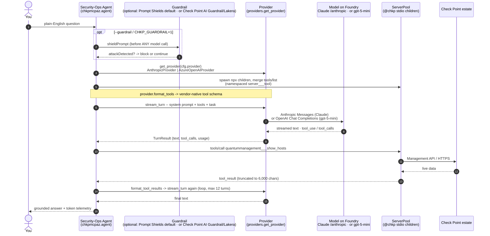

# How the agent operates

One question, end to end. Azure edition of the AWS repo's `agent-flow.svg` --
the numbered steps are the same; "Gateway + AgentCore Runtime" collapses into
the agent's own ServerPool of stdio children. The model hop goes through a
**provider seam** (`providers.get_provider(cfg.provider)`) so the identical
loop drives **Claude** (Anthropic Messages) or first-party **`gpt-5-mini`**
(OpenAI Chat Completions) without changing anything else.

Two Check Point pieces are in play: the **@chkp MCP servers** (always present --
they let the agent query and act on your Check Point estate) and an **optional
AI Guardrail** screen in front of the model. The MCP servers are the core; the
guardrail is opt-in and its engine is your choice.

```
python3 -m chkpmcpaz chat "how many hosts are configured?"
```



What each step guarantees (mirrors the AWS legend):

1. **You** ask a plain-English question about the estate.
2. *(optional)* The guardrail is the customer's choice of engine. By default it
   screens the input with Azure AI Content Safety **Prompt Shields** (the
   Azure-native engine, `CHKP_GUARDRAIL_PROVIDER=content-safety`). Opt in to
   Check Point's own **AI Guardrail (Lakera Guard)** with
   `CHKP_GUARDRAIL_PROVIDER=lakera` for one guardrail story that is identical on
   AWS and Azure. Either way, a detected prompt-injection/jailbreak blocks the
   run before the model sees it.
3. The agent spawns the selected `@chkp` servers as stdio children (Key Vault
   secrets injected into each child's env at spawn) and merges their tool
   catalogs under namespaced names. The **provider**
   (`providers.get_provider(cfg.provider)` → `AnthropicProvider` |
   `AzureOpenAIProvider`) formats those tools in the model's native schema.
4. The **model on Foundry** -- **Claude** (Anthropic Messages, default) or
   first-party **`gpt-5-mini`** (OpenAI Chat Completions) -- decides which
   Check Point tool to call and with what arguments, streaming its reasoning as
   it goes. The provider normalizes the vendor's stream into one `TurnResult`,
   so the loop is identical for both.
5. The child process queries the **real estate**; results are truncated and
   fed back with an `is_error` flag; a failed tool call is reported to the
   model, never a crash.
6. The loop repeats (steps 4–5) until the model has enough -- at most 12 turns
   -- and you get an answer **grounded in real tool output, not a guess**,
   followed by one telemetry line:

```
tokens  12,345 in · 890 out · 11,200 cache-read · 91% of input from cache
```

The same loop runs in your terminal (`--runtime local`) or inside the Foundry
Hosted Agent (`--runtime hosted`); with `--session`, the hosted runtime keeps
platform-managed conversation history across invocations.
