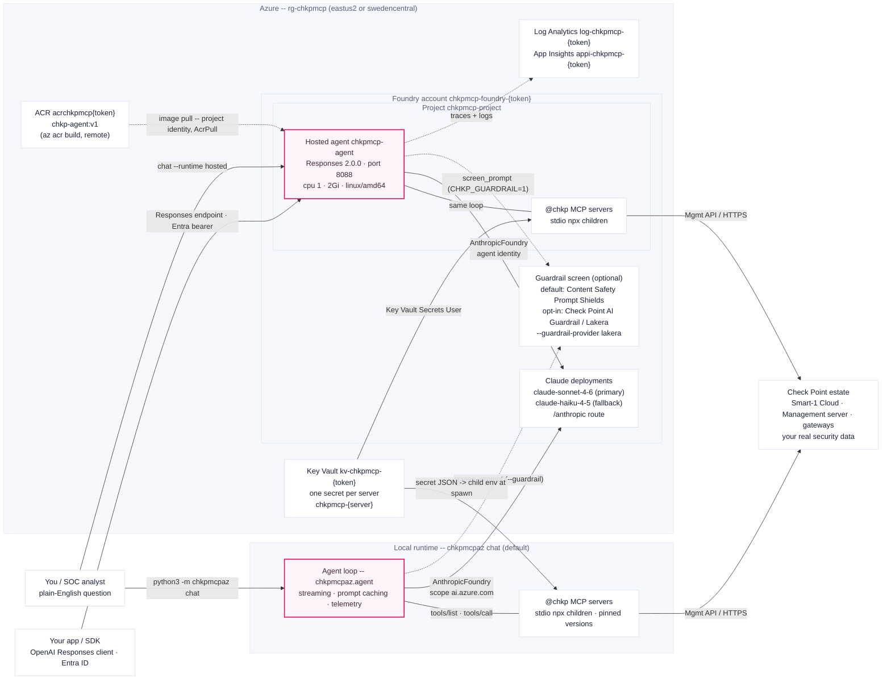

# Architecture

Check Point MCP servers as stdio children of a Claude-on-Foundry
security-ops agent -- runnable locally or as a Foundry Hosted Agent. Azure
edition of the AWS repo's `architecture.svg`; the biggest structural delta is
the missing middle tier: there is **no gateway** -- the `@chkp` servers are
child processes of the agent itself, and Entra ID replaces the whole
Cognito/JWT/SigV4 chain.

Reading notes:

- **Two runtimes, one loop.** `--runtime local` (default) runs the loop in
  your process; `--runtime hosted` invokes the identical loop packaged in the
  `chkp-agent:v1` container. Both spawn the same pinned `@chkp` children and
  talk to the same model deployments.
- **One loop, two providers.** The diagram shows the Claude production
  topology. A small provider seam (`providers.get_provider(cfg.provider)` →
  `AnthropicProvider` | `AzureOpenAIProvider`) lets the identical loop run on
  first-party **`gpt-5-mini`** instead -- the cheap test model (Azure's
  analog of Amazon Nova). On a `gpt-5-mini` stack the Claude deployments node
  is replaced by a single `gpt-5-mini` deployment reached over the OpenAI
  route, and the agent identity also holds `Cognitive Services OpenAI User`.
  See [Test cheaply without Claude](../../README.md#test-cheaply-without-claude-like-aws-nova).
- **Secrets flow one way.** Key Vault secret JSON is decoded into the child
  process environment at spawn time (plus `TELEMETRY_DISABLED=true`). Values
  never appear in logs, output, or the model context.
- **Auth is Entra ID at every hop.** Your `az login` identity locally; the
  per-agent Entra identity in the container (`Cognitive Services User` on the
  account, `Key Vault Secrets User` on the vault -- granted by the CLI after
  the agent exists).
- **Dashed lines are optional paths**: guardrail screening runs only with
  `--guardrail` / `CHKP_GUARDRAIL=1`; monitoring is always-on but passive.
- **The guardrail is optional, and the engine is your choice.** Two
  interchangeable engines sit behind one `screen_prompt` seam: **Azure AI
  Content Safety Prompt Shields** (the platform **default**,
  `CHKP_GUARDRAIL_PROVIDER=content-safety`) or **Check Point's own AI Guardrail
  (Lakera Guard)** (`--guardrail-provider lakera` /
  `CHKP_GUARDRAIL_PROVIDER=lakera`) -- one inline Guard API call that is
  identical on AWS and Azure, for one guardrail story across both clouds. Note
  that Azure `chat` has no `--guardrail-provider` flag: it reads
  `CHKP_GUARDRAIL_PROVIDER` (from env/`.env`). We do not force Lakera: customers
  already invested in Prompt Shields keep it; customers who want Check Point's
  unified-across-clouds engine opt in. The always-present `@chkp` MCP servers
  are separate -- they are the core; the guardrail is the optional screen in
  front of the model.
