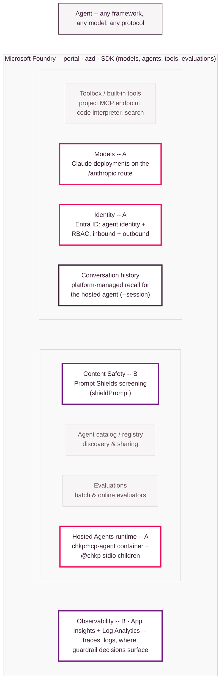

# Where Check Point fits on Microsoft Foundry

Azure edition of the AWS repo's `where-checkpoint-fits.svg`. That diagram
placed the integration on the AWS Bedrock AgentCore building blocks
(Runtime, Gateway, Identity, Memory, Policy, Observability); this one places
it on the **Microsoft Foundry** building blocks. The structural difference to
notice: AWS had a **Gateway** as the shared control point both modes passed
through -- on Azure there is no gateway tier, and the shared control point is
the **agent process itself** (the tools are its stdio children; the guardrail
screens its input).

**Legend** (colors mirror the AWS diagram):

- **Mode A -- Check Point as tools:** the
  `@chkp` MCP servers run as **stdio child processes** inside the **Hosted
  Agents runtime** sandbox (or your local process); **Models** does the
  reasoning -- Claude on the `/anthropic` route for production, or first-party
  **`gpt-5-mini`** for cheap testing, selected behind one provider seam;
  **Identity** (Entra ID) carries every hop's authentication -- there are no
  API keys and no custom auth tier.
- **Mode B -- guardrail (optional):** an
  inline prompt screen *before any model call* (`chat --guardrail` /
  `CHKP_GUARDRAIL=1`). The engine is the customer's free choice of two
  interchangeable options: **Content Safety Prompt Shields** (the Azure-native
  **default**, `CHKP_GUARDRAIL_PROVIDER=content-safety`) or **Check Point's own
  AI Guardrail (Lakera Guard)** as a drop-in opt-in (`deploy
  --guardrail-provider lakera` / `CHKP_GUARDRAIL_PROVIDER=lakera`) -- one Guard
  API call, identical on AWS and Azure. Unlike Mode A's `@chkp` tools -- the
  always-present core -- the guardrail is opt-in and never forced; allow/block
  outcomes and run traces surface in **Observability**.
- **Dark outline -- used, mode-neutral:** platform-managed **conversation
  history** gives the hosted agent cross-invocation recall (`--session`).
- **Grey -- Foundry building blocks this integration does not use:** the
  project **Toolbox** MCP endpoint (our tools are in-process stdio children,
  not attached platform tools), the **agent catalog/registry**, and
  **Evaluations**.

*Redrawn schematic of the Microsoft Foundry building blocks -- not a
Microsoft asset. Mode B's **default** engine is Azure's native Prompt Shields,
shown here as the guardrail decision point; the same decision point
interchangeably runs Check Point's own **AI Guardrail (Lakera Guard)** as a
drop-in, opt-in provider (`deploy --guardrail-provider lakera` /
`CHKP_GUARDRAIL_PROVIDER=lakera`) -- GA today, one Guard API call that is
identical on AWS and Azure. The engine is the customer's free choice, and
Prompt Shields stays the default so customers already invested in Azure's
native guardrail keep it. Only Check Point's *deeper* AI runtime-protection
integration (binding Check Point signals into the platform's per-tool action
decisions, beyond this prompt screen) is Early Access -- contact Check Point.
Azure Key
Vault (per-server Check Point credentials) sits outside the Foundry primitive
grid but is load-bearing -- see [architecture.md](architecture.md).*
