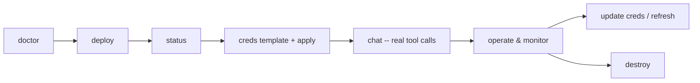

# Scenario: Credentials and go-live

Use this after the stack is understood and you are preparing to run it with
real Check Point credentials, operate it, troubleshoot it, or tear it down.

This is field automation for a fixed-name stack, not a full production
system. For durable customer environments, extend the Bicep under `infra/`
into your organization's standard IaC pipeline.

## Operational lifecycle



## Preflight

```
python3 -m chkpmcpaz doctor
az account show
```

Common credential-shaped failures at any point print this and exit 1 (no
traceback):

```
Your Azure session has expired or credentials are unavailable.
Log in again (az login, or azd auth login), then re-run the same
command -- every command here is idempotent, so re-running is safe.
  (<ExceptionType>: <message truncated to 160 chars>)
```

A deploy takes 10–20 minutes, so start with a fresh session; if it expires
mid-run, re-authenticate and re-run the same command -- it picks up where it
left off.

## The secret model

**Every credentialed server gets its own Key Vault secret**, named
`<prefix>-<server>` (e.g. `chkpmcp-quantum-management`,
`chkpmcp-cloudguard-waf`). Nothing is shared -- `quantum-management` and
`management-logs` can point at *different* management servers if you want.

- Management-shaped servers (`quantum-management`, `management-logs`,
  `threat-prevention`, `https-inspection`, `policy-insights`,
  `quantum-gw-cli`) use the same credential *fields*
  (`MANAGEMENT_HOST`/`API_KEY`, or Smart-1 Cloud-style `S1C_URL`/`API_KEY` if
  your package version expects it) -- but each in its own secret. Note
  `quantum-gw-cli` authenticates to the **Management server**, not Gaia.
- Product-specific servers each have their own fields -- see the
  [server catalog](../servers.md).
- `quantum-gaia` gets no in-process secret (interactive elicitation auth) but
  carries the **agent-side** secret `<prefix>-quantum-gaia` the agent reads to
  answer the login prompt; `GAIA_*` env vars override it locally.

Deploy writes **placeholders** (`PLACEHOLDER_NOT_A_REAL_KEY`) so every server
starts and fails auth cleanly until real values arrive. A re-deploy **never**
overwrites a secret whose body already holds real values, and it recovers a
soft-deleted secret before writing.

## The local credentials workflow (recommended)

**Coming from the AWS project?** Skip the template: `chkp-credentials.env`
is byte-compatible between `checkpoint-mcp-on-aws-agentcore` and this repo
(same sections, same keys). Copy it and apply:

```
cp ../checkpoint-mcp-on-aws-agentcore/chkp-credentials.env .
python3 -m chkpmcpaz creds apply       # or at deploy time: deploy --creds
```

Starting fresh:

```
python3 -m chkpmcpaz creds template
```

Writes `chkp-credentials.env` -- one `[server]` section per **deployed**
server with that server's credential keys, plus `[quantum-gaia]`. It refuses
to overwrite an existing file. The file is gitignored; never commit it. Edit
it with real values:

```ini
[quantum-management]
MANAGEMENT_HOST=your-mgmt.example.com
MANAGEMENT_PORT=443
API_KEY=your-real-api-key

[reputation-service]
API_KEY=your-threatcloud-key
```

Then:

```
python3 -m chkpmcpaz creds apply
```

`apply` parses the INI (case-preserving, no `%` interpolation), **skips**
unknown, empty, and still-placeholder sections with printed reasons, writes
each remaining section to its own Key Vault secret, and finishes by
triggering `refresh` so the hosted agent re-reads the new values. Secret
values are never printed or logged -- only names.

### Providing credentials at deploy time

If the file is already filled in, hand it to `deploy` and skip the separate
apply:

```
python3 -m chkpmcpaz deploy --servers all --creds chkp-credentials.env
```

Servers absent from the file (or still holding placeholders) get placeholders
as usual.

### Editing a secret by hand

You can also set a secret directly (from a trusted shell; mind your shell
history policy):

```
az keyvault secret set --vault-name <kv-name> \
  --name chkpmcp-quantum-management \
  --value '{"MANAGEMENT_HOST":"<host>","MANAGEMENT_PORT":"443","API_KEY":"<api-key>"}'
```

Follow a manual edit with `python3 -m chkpmcpaz refresh` (see below).

## Why `refresh` exists (and when you don't need it)

- **Local runtime**: secrets are fetched and injected into the `@chkp` child
  processes **at every spawn** -- a credential change is picked up by the very
  next `chat` run. No refresh needed.
- **Hosted runtime**: the hosted agent's sandboxes are long-lived, and each
  child spawn inside them reads the secret via the agent identity -- but a
  sandbox that cached state (or one you want to force-recycle) is restarted by
  `python3 -m chkpmcpaz refresh`, which bumps the agent's version so Foundry
  replaces the sandboxes. `creds apply` runs this for you.

Smoke-test after any credential change:

```
python3 -m chkpmcpaz chat "how many hosts are configured?"
```

## TLS note for on-prem management servers

Check before a customer run: the on-prem client bundled in
`@chkp/quantum-infra` (used by `@chkp/quantum-management-mcp` and related
packages when talking to `MANAGEMENT_HOST`) hardcodes
`rejectUnauthorized: false` in its HTTPS agent -- a certificate-verification
bypass in the **upstream package**, not in this repo. This repo's own code
never disables TLS verification (unit-tested). Prefer **Smart-1 Cloud**
(`S1C_URL`) where possible -- its client path keeps verification on -- and
flag the on-prem behavior to the `@chkp` product team before relying on it in
a security-sensitive environment.

## Verifying the stack

```
python3 -m chkpmcpaz status
```

Read-only; checks azd outputs, Foundry account/project, callable Claude
deployments, per-server secret presence (placeholder-or-real, names only),
the ACR image, hosted-agent state and endpoint, Content Safety reachability,
and local Node/npx -- each failure with its own remediation text. `--json`
for machines. Interpreting the common model errors: **401** = wrong Entra
scope (must be `https://ai.azure.com/.default`); **403** = missing
`Cognitive Services User` (or RBAC still propagating -- up to 30 minutes);
**429** = the deployment's TPM capacity.

## Observability

- Full verbose transcript of every command: `~/.chkpmcpaz/logs/` (override
  with `CHKP_LOG_DIR`).
- Hosted agent traces and logs: Application Insights
  (`appi-<prefix>-<token>`) -- the connection string is auto-injected into
  the sandboxes, and the protocol library emits OpenTelemetry by default.
- Per-run token telemetry is printed by the agent itself.

## Cost notes

Watch these while the stack is up: Claude deployment usage (GlobalStandard),
hosted-agent sandbox compute (cpu+memory across active sessions; idle
sandboxes deprovision after ~15 minutes), ACR Basic storage, Log Analytics
ingestion, Key Vault operations. Private networking you add by hand is
outside the teardown model.

## Teardown

```
python3 -m chkpmcpaz destroy
```

1. Read-only inventory: resource group, hosted agent, Key Vault secrets
   (including soft-deleted), ACR images, Claude deployments.
2. Plan printed; `y/N` confirmation (`--yes` required when stdin is not a
   TTY).
3. Hosted agent deleted (data plane).
4. `azd down --force --purge` -- removes the resource group and **purges**
   the Key Vault and Cognitive Services soft-deletes so an immediate redeploy
   under the same names works.

`--force-delete-secret` additionally purges soft-deleted secrets if the vault
survives. On a clean subscription: `Nothing to destroy.` Re-runs are safe.

> **Real credentials do not survive a full destroy.** Unlike the AWS port's
> 7-day secret recovery, the `--purge` teardown removes the vault contents
> permanently (individually deleted secrets do keep a 7-day soft delete while
> the vault lives). Keep your gitignored `chkp-credentials.env` and re-apply
> with `deploy --creds` or `creds apply` after a rebuild.

### Verifying teardown

```
az group exists --name rg-chkpmcp
az keyvault list-deleted --query "[?name=='<kv-name>']"
```

Expect `false` and an empty list. If something lingers, re-run
`python3 -m chkpmcpaz destroy` -- it tolerates already-missing resources.

### What teardown does not remove

Only resources this stack created under its fixed names. Not removed: private
endpoints/VNets you added, extra secrets you created manually outside the
naming scheme, renamed resources, or anything provisioned by other tooling.
Remove those with the tool that created them.

## Production hardening checklist

- Use read-only / least-privilege Check Point API credentials.
- Keep the pinned `@chkp/*` versions; re-test `tools/list` after any pin
  bump (tool names and schemas may change).
- Split credentials by privilege boundary -- the per-server secret model
  already supports it.
- Restrict who holds `Key Vault Secrets Officer` and Foundry Project Manager;
  agent consumers need only `Foundry Agent Consumer`.
- Move the Bicep into your standard IaC pipeline; replace fixed names with
  environment-specific ones via `--prefix`.
- Decide log retention and redaction policy for `~/.chkpmcpaz/logs/` and Log
  Analytics.
- Never commit secrets, `.env` files, tokens, or screenshots exposing
  subscription ids, hostnames, or endpoints. Before handoff:
  `git status --short && git diff --check`.
