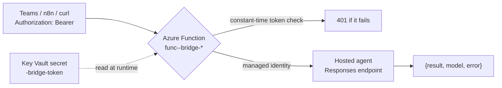

# Scenario: Invoke the agent from anywhere (the bridge)

The Foundry Hosted Agent's Responses endpoint is a first-class HTTPS API, but
it requires an **Entra ID** OAuth2 token (minted via `DefaultAzureCredential`
on the `ai.azure.com` scope) plus a Foundry data-plane role. That is the right
door for Azure-aware clients -- but a Microsoft Teams flow, an n8n webhook, or a
curl script on a laptop cannot mint that token without `az login` or a service
principal.

The **bridge** removes exactly that friction: one Azure Function that accepts a
**static bearer token** and forwards to the hosted agent with its own managed
identity. Same idea as the AWS port's Lambda + API Gateway bridge.

> [!IMPORTANT]
> The token is generated at `provision` and stored **only** in a Key Vault
> secret (`<prefix>-bridge-token`) -- never in code, config, or logs (org
> policy). Rotate it by writing a new value to that secret; the Function
> re-reads it within ~5 minutes.

## How it wires in



## Provision

Deploy the stack (with the hosted agent) first, then:

```
python3 -m chkpmcpaz bridge provision
```

That creates a storage account, a Consumption Linux/Python Function app with a
system-assigned identity, grants that identity `Key Vault Secrets User` (to read
the token) and `Cognitive Services User` at account scope (to invoke the agent),
writes the token secret, and zip-deploys the handler.

## Call it

```
python3 -m chkpmcpaz bridge show
```

prints the URL and a ready-to-run curl. The shape:

```
TOKEN=$(az keyvault secret show --vault-name <kv> --name <prefix>-bridge-token \
  --query value -o tsv | python3 -c 'import sys,json;print(json.load(sys.stdin)["token"])')

curl -s -X POST 'https://func-<prefix>-bridge-<hash>.azurewebsites.net/api/invoke' \
  -H "Authorization: Bearer $TOKEN" \
  -H 'Content-Type: application/json' \
  -d '{"prompt": "how many hosts are configured?"}'
```

Response:

```json
{ "result": "…grounded answer…", "model": "chkpmcp-agent", "error": false }
```

- Body: `{"prompt": "...", "session": "optional"}` (`task`, `text`, `question`
  are accepted aliases for `prompt`).
- Header: `Authorization: Bearer <token>` (or `X-Bridge-Token: <token>`).
- A missing/wrong token returns `401`; a bad body `400`; an agent failure `502`.

`bridge show --reveal-token` also prints the token itself (otherwise only the
`az keyvault` command to fetch it).

## Postman

Import [`collateral/Check-Point-MCP-Agent.postman_collection.json`](../../collateral/Check-Point-MCP-Agent.postman_collection.json).
Set the collection variables `bridgeUrl` and `bridgeToken`, then run **Invoke
(bearer)**. The Azure-aware alternative (an Entra bearer straight at the
Responses endpoint, no bridge) is documented in the collection's second request.

## Teardown

```
python3 -m chkpmcpaz bridge destroy
```

removes the Function app and storage account. A full `python3 -m chkpmcpaz
destroy` also removes them (they live in the stack's resource group) and purges
the token secret with the vault.

## Security notes

- Every call is authenticated (org policy): the Function's first action is a
  constant-time bearer-token compare; no token, no invoke.
- TLS is always on -- Azure Functions serve HTTPS and the handler never
  disables certificate verification.
- The bridge holds no Check Point credentials; it only forwards prompts. The
  agent still reads its per-server secrets from Key Vault with its own identity.
- Prefer keeping the bridge **off** unless you need a non-Azure caller; the
  Entra-native Responses endpoint is the least-privilege path for Azure clients.
