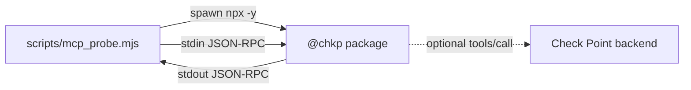

# Scenario: Local MCP probing

Use this when you want to inspect a Check Point MCP package **without any
Azure resources at all**. It is the fastest way to answer "which tools does
this package expose?", "does it start?", and "can one tool call reach my
backend?"

The probe is [scripts/mcp_probe.mjs](../../scripts/mcp_probe.mjs) -- a small
stdio MCP client with no dependencies beyond Node.js itself.

## What this proves

The probe proves the MCP server process starts, speaks JSON-RPC over stdio,
responds to `initialize`, and returns a tool catalog from `tools/list` --
optionally that a single `tools/call` works against your backend.

It does not prove the deployed stack (Foundry, Key Vault, the hosted agent).
That is what `python3 -m chkpmcpaz status` and the
[quickstart](quickstart.md) cover.

## Request flow



## Usage

```
node scripts/mcp_probe.mjs <package@version> [tool] [json-args]
```

- `package@version` -- the pinned npm package to spawn (use the catalog pins
  from [docs/servers.md](../servers.md) for reproducibility).
- `tool` *(optional)* -- a tool name to call after `tools/list`.
- `json-args` *(optional)* -- the tool's arguments as a JSON object string.

The probe spawns the package over stdio with `TELEMETRY_DISABLED=true`, runs
`initialize` → `tools/list` (printing the tool names) → the optional
`tools/call`, and prints the raw JSON-RPC frames so the wire sequence is
visible.

## Prerequisites

| Need | Notes |
|---|---|
| Node.js 20+ | `node --version` |
| npm registry access | `npx -y` downloads the package at spawn time. |
| Check Point credentials | Not needed for `tools/list` on most packages; needed for real `tools/call`s. |

## List a package's tools

Many `@chkp` packages register their catalog statically, so `tools/list`
works without real credentials:

```
node scripts/mcp_probe.mjs @chkp/quantum-management-mcp@1.4.7
```

Some servers need extra **startup** flags. `documentation-mcp` requires
`--region` (see [docs/servers.md](../servers.md)), passed through the
`CHKP_ARGS` env var -- the same convention the agent uses to inject
`ServerSpec.args`:

```
CHKP_ARGS="--region US" node scripts/mcp_probe.mjs @chkp/documentation-mcp@1.4.6
```

## Call a tool against a real backend

Only with credentials that are safe for your environment -- exported as env
vars (the packages read their credentials from the environment), never
committed, never pasted into shared terminals:

```
export MANAGEMENT_HOST="<management-host>"
export MANAGEMENT_PORT="443"
export API_KEY="<read-only-api-key>"

node scripts/mcp_probe.mjs @chkp/quantum-management-mcp@1.4.7 show_hosts '{}'
```

Smart-1 Cloud-style, if your package version expects it:

```
export S1C_URL="<smart-1-cloud-url>"
export API_KEY="<read-only-api-key>"

node scripts/mcp_probe.mjs @chkp/quantum-management-mcp@1.4.7 show_hosts '{}'
```

## Transport warning

The `@chkp` servers are safe to run locally over **stdio** -- that is exactly
how this repo's agent runs them, as child processes inside an authenticated
boundary (your terminal session, or the Entra-gated hosted-agent sandbox).
Some packages also offer an HTTP transport; do **not** expose that to a
network by itself -- it has no auth/TLS envelope. Anything remote must sit
behind a real authenticated boundary (org policy: every endpoint
authenticated).

## Troubleshooting

| Symptom | Likely cause | Fix |
|---|---|---|
| Usage line printed, exit | No package argument. | Pass a package, e.g. `@chkp/documentation-mcp@1.4.6`. |
| Hangs / timeout | Package download, startup, or the backend call hung. | Check network access, the package name/pin, credentials, and the server's stderr. |
| No tools printed | The server failed before `tools/list` (some, like `argos-erm`, need real creds to enumerate tools). | Provide real credentials, or probe a package with a static catalog. |
| `tools/list` works, `tools/call` fails | Static catalog registration but no live backend connectivity. | Replace dummy env values with valid read-only credentials; verify reachability. |

## When to move on

Use the deployed stack instead of the probe when you want the full agent
(reasoning + grounding), Key Vault-managed credentials, the hosted
Entra-authenticated endpoint, or a repeatable demo:
[quickstart](quickstart.md).

You don't need Claude -- or a pay-as-you-go subscription -- to get the full
agent cheaply. Deploy the first-party **`gpt-5-mini`** test path on an
MSDN / Dev-Test subscription (the Azure analog of Amazon Nova on Bedrock) and
run the identical `@chkp` tool loop against it:

```
python3 -m chkpmcpaz deploy --model gpt-5-mini --subscription <msdn-sub-id>
python3 -m chkpmcpaz chat "how many hosts are configured?"
```

See [Cheap test path (gpt-5-mini)](quickstart.md#cheap-test-path-gpt-5-mini).
