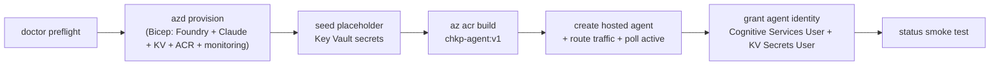

# Scenario: Quickstart -- fresh machine to grounded answer

Everything runs through one cross-platform CLI, `python3 -m chkpmcpaz`, on
Windows, macOS, and Linux. This walkthrough assumes a fresh machine; skip
whatever you already have. Local Docker is **not** required -- the agent image
builds remotely in ACR.

## What you end up with

- A Foundry account + project in `eastus2` (or `swedencentral`) with two
  Claude deployments (`claude-sonnet-4-6`, `claude-haiku-4-5`).
- A Key Vault holding one **placeholder** secret per selected `@chkp` server.
- The agent container `chkp-agent:v1` in ACR and a running Foundry Hosted
  Agent `chkpmcp-agent`.
- A security-ops agent you can ask plain-English questions about a Check
  Point estate -- locally or via the hosted Responses endpoint.

> **No pay-as-you-go subscription, or just want to test cheaply?** Skip Claude
> and run the identical loop on a first-party **Azure OpenAI `gpt-5-mini`**
> deployment -- the Azure analog of Amazon Nova on Bedrock. It deploys on an
> MSDN / Visual Studio Dev-Test subscription where Claude is blocked, needs no
> `--org`, and is covered by your Visual Studio credits. Jump to
> [Cheap test path (gpt-5-mini)](#cheap-test-path-gpt-5-mini).

## Deploy flow



## 1. Prerequisites

| Need | Check |
|---|---|
| Python 3.11+ | `python3 --version` |
| Azure CLI | `az version` |
| Azure Developer CLI ≥ 1.25.3 | `azd version` |
| Node.js 20+ (`npx`) | `node --version` |
| Azure subscription with **pay-as-you-go billing** | *Claude path only.* Claude rejects CSP / free-trial / credit-only subscriptions. The [`gpt-5-mini` test path](#cheap-test-path-gpt-5-mini) is exempt -- it deploys on MSDN / Dev-Test subscriptions. |
| Permission to subscribe to Marketplace model offerings + Contributor/Owner on the resource group | *Claude path only.* Bicep auto-accepts Anthropic's commercial terms via `modelProviderData`. `gpt-5-mini` is first-party -- no Marketplace offer, no `--org`. |

## 2. Install

From the repo folder:

```
python3 -m venv .venv
source .venv/bin/activate
python3 -m pip install -e ".[mcp,hosting,dev]"
```

(Windows PowerShell: `.\.venv\Scripts\Activate.ps1` instead of the `source`
line.)

## 3. Log in and preflight

```
az login
azd auth login
python3 -m chkpmcpaz doctor
```

`doctor` is local-only and mutation-free: it checks the tooling versions, the
login, the target location (`eastus2`/`swedencentral` only), warns if the
subscription type cannot deploy Claude, and confirms the optional extras
import. Fix hard failures before deploying; warnings are informational.

## 4. Deploy

```
python3 -m chkpmcpaz deploy --org "Your Company Name"
```

`--org` (or the `CLAUDE_ORGANIZATION_NAME` env var) is the organization name
attested to Anthropic with the terms acceptance; country and industry default
to `US` / `technology` (env `CLAUDE_COUNTRY_CODE` / `CLAUDE_INDUSTRY` --
industry must be lowercase). Typically 10–20 minutes; the Claude
model-deployment LRO is the variable step. The full transcript is tee'd to
`~/.chkpmcpaz/logs/`.

If your session expires mid-run, you get a friendly re-auth message instead
of a traceback -- log in again and **re-run the same command**; every command
is idempotent.

Useful variants:

```
python3 -m chkpmcpaz deploy --servers "quantum-management reputation-service"
python3 -m chkpmcpaz deploy --servers all --creds chkp-credentials.env
python3 -m chkpmcpaz deploy --no-agent
```

## 5. Verify

```
python3 -m chkpmcpaz status
```

Read-only, safe to repeat, exits 1 with specific remediation per failing
check. If a fresh deploy shows 403s on the Claude probe, wait -- RBAC
propagation can take up to 30 minutes.

## 6. Ask the agent

```
python3 -m chkpmcpaz chat "how many hosts are configured, and what access layers exist?"
```

The answer streams live; each run ends with the token/cache telemetry line.
With placeholder credentials the tool calls will error against a non-existent
estate -- the chain still proves itself (Claude → stdio tools → loop). Load
real credentials to get real data:

```
python3 -m chkpmcpaz creds template
python3 -m chkpmcpaz creds apply
```

(Edit `chkp-credentials.env` between the two -- see
[credentials and go-live](creds-and-golive.md). **Have the AWS project?** Its
`chkp-credentials.env` is byte-compatible: copy it over and skip the template,
or hand it straight to the deploy with `deploy --creds`.)

Hosted runtime, with conversation continuity:

```
python3 -m chkpmcpaz chat --runtime hosted --session soc-review "how many hosts are configured?"
python3 -m chkpmcpaz chat --runtime hosted --session soc-review "which of those did we discuss last time?"
```

Run `python3 -m chkpmcpaz chat` with no task for the example-question catalog
(exit 2 by design -- a task is required).

## 7. Tear down

```
python3 -m chkpmcpaz destroy
```

Prints the inventory-based plan, asks `y/N` (pass `--yes` in non-interactive
shells), removes the hosted agent, then `azd down --force --purge`. Note the
purge means Key Vault secrets do **not** survive a full destroy -- keep your
gitignored `chkp-credentials.env` and re-apply on the next deploy.

## Cheap test path (gpt-5-mini)

Everything above uses Claude (production). To test **without** Claude -- no
pay-as-you-go subscription, no Marketplace terms -- run the **identical** loop
on a first-party **Azure OpenAI `gpt-5-mini`** deployment. It is the Azure
analog of falling back to **Amazon Nova** on Bedrock: a cheap model that still
exercises the whole chain (hosted agent → provider → `@chkp` MCP tools →
grounded answer), end to end.

`gpt-5-mini` is a **first-party** Azure model (`format: 'OpenAI'`, version
`2025-08-07`, `GlobalStandard`) -- not a Marketplace offer -- so it deploys on
an **MSDN / Visual Studio Dev-Test subscription** (region `eastus2`,
`gpt-5-mini` `GlobalStandard` quota 2000) where Claude is blocked, and the
usage is covered by your Visual Studio subscription credits (effectively free
for testing). `doctor` knows this: on the `azure-openai` provider it skips the
pay-as-you-go / credit-offer check and reports the `gpt-5-mini` quota as OK.

### 1. Deploy

The provider is auto-detected from `--model gpt-5-mini` (a `gpt-*` name →
`azure-openai`); there is **no `--org`**. Point at your Dev-Test subscription
with the global `--subscription` flag:

```
python3 -m chkpmcpaz deploy --model gpt-5-mini --subscription <msdn-sub-id>
```

Equivalent explicit form (provider forced instead of inferred):

```
python3 -m chkpmcpaz deploy --provider azure-openai --model gpt-5-mini --subscription <msdn-sub-id>
```

`deploy` runs `doctor`'s preflight first with the resolved `azure-openai`
provider -- so it skips the pay-as-you-go / credit-offer check and verifies the
`gpt-5-mini` `GlobalStandard` quota (2000 in `eastus2`) instead of the Claude
eligibility rules. It then provisions **only** the first-party `gpt-5-mini`
deployment (the Bicep sets `deployOpenAiModel=true`, `deployClaudeModels=false`),
grants the hosted-agent identity `Cognitive Services OpenAI User` for inference,
and outputs `OPENAI_BASE_URL` / `OPENAI_MODEL_DEPLOYMENT`. The deploy persists
`CHKP_PROVIDER=azure-openai` and `CHKP_MODEL=gpt-5-mini` in the azd env.

### 2. Chat against it

Because the provider/model are persisted, later commands target the deployed
gpt stack automatically -- plain `chat` and `status` just work:

```
python3 -m chkpmcpaz status
python3 -m chkpmcpaz chat "how many hosts are configured, and what access layers exist?"
```

Force the model explicitly (e.g. on a stack that also has Claude), local or
hosted:

```
python3 -m chkpmcpaz chat --model gpt-5-mini "how many hosts are configured?"
python3 -m chkpmcpaz chat --runtime hosted --model gpt-5-mini --session soc-review "how many hosts are configured?"
```

Everything else is unchanged: the same system prompt, 12-turn budget,
6,000-char tool-result truncation, streaming, per-run token telemetry, retries,
and the optional guardrail (Prompt Shields by default, or Check Point AI
Guardrail / Lakera via `--guardrail-provider lakera`). Tear down exactly as in step 7 (`destroy` removes
the `gpt-5-mini` deployment with the rest of the stack). The **Claude
production path is fully intact** -- deploy with `--org "Your Company"` (no
`--model`, or `--model claude-sonnet-4-6`) to get the Claude stack as above.

## Next steps

- [Credentials and go-live](creds-and-golive.md) -- the secret model, real
  credentials, operations, teardown details.
- [Guardrail](guardrail.md) -- an optional inline prompt screen with two
  interchangeable engines: Check Point AI Guardrail (Lakera Guard,
  `--guardrail-provider lakera` -- the Check Point-native option, identical on
  AWS and Azure) or Azure Content Safety Prompt Shields (the default), plus the
  scripted injection test.
- [Local MCP probing](local-probe.md) -- inspect a `@chkp` package with no
  Azure at all.
